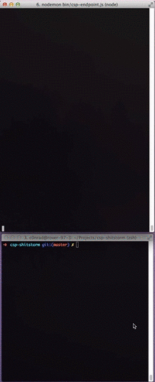

# csp-shitstorm

Stress testing tool for CSP violation report endpoints.

## Example


## Usage
```
➜  csp-shitstorm git:(master) ✗ node bin/csp-shitstorm.js --help

Usage: node csp-shitstorm.js [options]

Options:
   --url     The url of the endpoint to send reports  [http://localhost:3000]
   --delay   Number of miliseconds to wait between sending reports  [100]
```

## Install
```bash
npm install -g csp-shitstorm
```

## Contact

Stuart Larsen c0nrad@c0nrad.io
